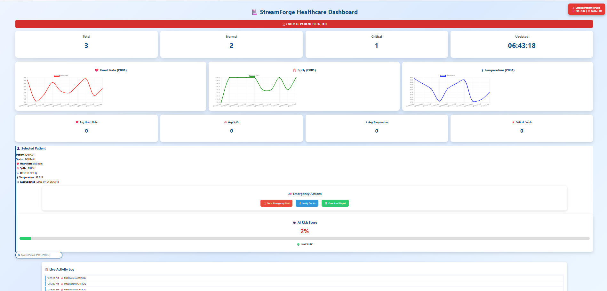
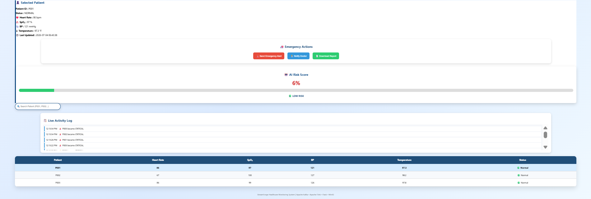

# StreamForge

A real-time healthcare monitoring platform built using **Apache Kafka, Apache Flink, Flask, Docker and MinIO**. StreamForge continuously monitors patient vital signs, detects critical conditions, stores historical patient records and provides a live dashboard with charts, alerts and analytics.

---

## Why this project is different

Most student data projects are batch ETL pipelines that process static CSV files. StreamForge is a real-time streaming system that:

- Ingests continuous patient vital sign data using **Apache Kafka**
- Processes and validates streaming data using **Apache Flink**
- Detects abnormal patient conditions using an **LSTM Autoencoder**
- Stores patient history in **MinIO**
- Provides a live **Flask Dashboard** with charts, alerts, analytics and patient history
- Runs inside **Docker** containers for easy deployment

---

## Architecture

```
Patient Sensor Data
        │
        ▼
Kafka Topic (patient-vitals)
        │
        ▼
Apache Flink
(Data Cleaning + Validation + Status Detection)
        │
        ▼
Kafka Topic (patient-vitals-processed)
        │
        ├────────────────────┐
        ▼                    ▼
Flask Dashboard         Storage Writer
(Live Monitoring)            │
                             ▼
                          MinIO Storage
                    (Patient History)
```

---

## Tech Stack

| Component  | Technology          |
| ---------- | ------------------- |
| Frontend   | HTML CSS JavaScript |
| Backend    | Flask               |
| Streaming  | Apache Kafka        |
| Processing | Apache Flink        |
| Storage    | MinIO               |
| ML         | LSTM Autoencoder    |
| Charts     | Chart.js            |
| Container  | Docker              |

---

## Features

- Live patient monitoring dashboard
- Real-time vital sign streaming
- Apache Kafka message streaming
- Apache Flink stream processing
- AI Risk Score calculation
- Critical patient alerts
- Historical patient data visualization
- Download patient report (CSV)
- Notify Doctor feature
- Emergency Alert button
- Patient Search
- Live charts using Chart.js
- MinIO cloud storage
- Dockerized deployment

---

## How It Works

1. **Producer (`producer.py`)** simulates real-time patient vitals (Heart Rate, SpO₂, Blood Pressure and Temperature).

2. **Apache Kafka** receives the live patient data.

3. **Apache Flink** validates, cleans and processes every incoming record before publishing it to a processed Kafka topic.

4. **Storage Writer** stores processed patient history inside **MinIO**.

5. **Flask Dashboard** consumes processed patient data from Kafka and updates the dashboard every **2 seconds** with:
   - Live Charts
   - AI Risk Score
   - Critical Alerts
   - Patient History
   - Analytics

---

## Setup & Running Locally

### Prerequisites

- Docker Desktop

### Start the Project

```bash
docker compose up -d --build
```

---

## Open Services

### Dashboard

```
http://localhost:5000
```

### Apache Flink Dashboard

```
http://localhost:8081
```

### MinIO Console

```
http://localhost:9001
```

Username

```
minioadmin
```

Password

```
minioadmin
```

---

## Project Status

- ✅ Kafka Producer
- ✅ Kafka Consumer
- ✅ Apache Flink Stream Processing
- ✅ Flask Live Dashboard
- ✅ Live Charts
- ✅ AI Risk Score
- ✅ Critical Patient Alerts
- ✅ Patient History (MinIO)
- ✅ Download Patient Report
- ✅ Docker Deployment

### Future Enhancements

- Kubernetes Deployment
- Apache Iceberg Storage
- Grafana Monitoring
- Real IoT Sensor Integration
- Email / SMS Alert Notifications

---

## Author

Developed as an academic real-time healthcare monitoring project using **Apache Kafka, Apache Flink, Flask, Docker and MinIO**.


## Dashboard Preview

### Live Healthcare Dashboard



### Patient Monitoring & Analytics


